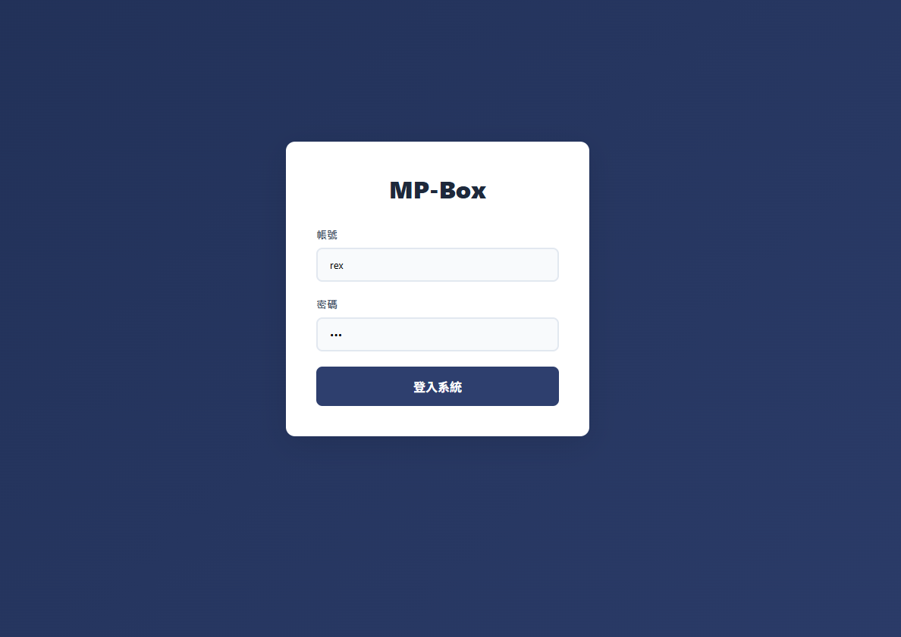

## 登入畫面

## 欄位說明

| 欄位     | 元件             | 必填  | 說明       |
| ------ | -------------- | --- | -------- |
| **帳號** | text input     | 是   | email 格式 |
| **密碼** | password input | 是   | 輸入時遮蔽    |

## 操作說明

**[登入]**
- → `Api/fn_auth_01_login_api.md`
  - 傳入：**帳號**、**密碼**
  - 成功：儲存身分憑證，跳轉首頁
  - 失敗：顯示錯誤訊息「帳號或密碼錯誤」
