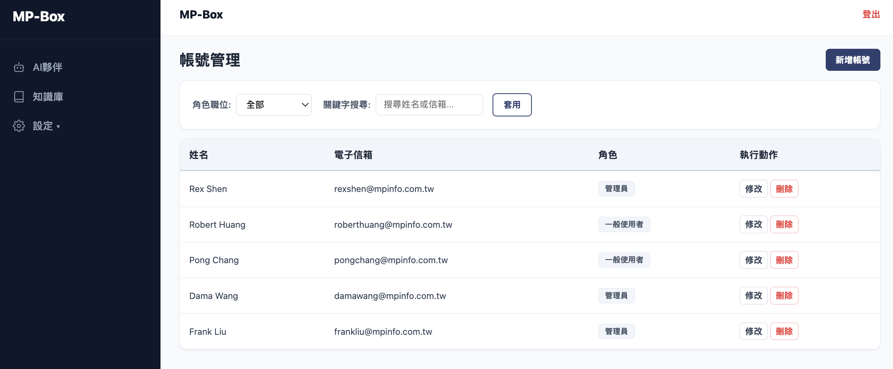

# f_user_01 — 帳號清單

## 畫面名稱：查詢模式

## 畫面

帳號管理主頁，包含篩選列與帳號資料表格。

## 欄位說明

### 篩選列

| 欄位 | 元件 | 說明 |
|---|---|---|
| 角色職位 | select | 選項來源：roles 表所有角色名稱，加上「全部」選項（預設選中） |
| 關鍵字搜尋 | text input | 搜尋範圍：姓名、電子信箱 |

### 帳號清單表格

| 欄位 | 資料來源 | 顯示格式 |
|---|---|---|
| 姓名 | users.name | 純文字 |
| 電子信箱 | users.email | 純文字 |
| 角色 | roles.name（透過 user_roles） | 每個角色以 badge 顯示，可多個 |
| 執行動作 | — | 修改按鈕 / 刪除按鈕 |

## 操作說明

**[新增帳號]**（頁面右上角按鈕）
- 開啟帳號表單 → 新增模式

**[套用]**（篩選列按鈕）
- → `Api/f_user_query.api.md`
  - 傳入：role_id（若選「全部」則不傳）、keyword
  - 成功：重新渲染表格

**[修改]**（各列操作欄按鈕）
- 帶入該帳號資料，開啟帳號表單 → 修改模式

**[刪除]**（各列操作欄按鈕）
- 顯示確認 Dialog：「確定要刪除此帳號嗎？無法復原。」
- 確認後 → `Api/f_user_del.api.md`
  - 傳入：user_id
  - 成功：重新整理清單
  - 失敗：顯示錯誤訊息
