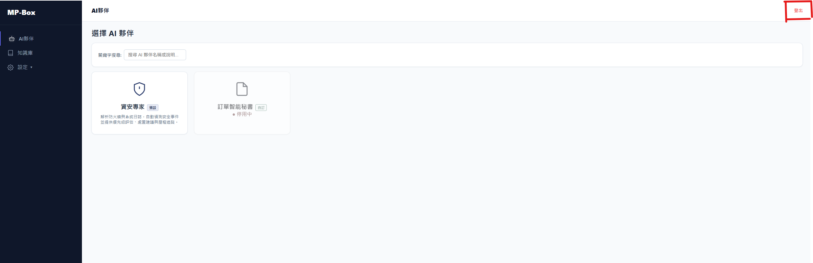

## 登出畫面

## 欄位說明

| 元件   | 位置   | 說明      |
| ---- | ---- | ------- |
| 登出按鈕 | 頂部右側 | 所有頁面均顯示 |

## 操作說明

**[登出]**（頂部右側按鈕）
- → `Api/fn_auth_02_logout_api.md`
  - 傳入：（無，憑證由 HTTP header 帶入）
  - 成功：清除本地憑證，跳轉登入頁
  - 失敗：顯示錯誤訊息，不強制登出
